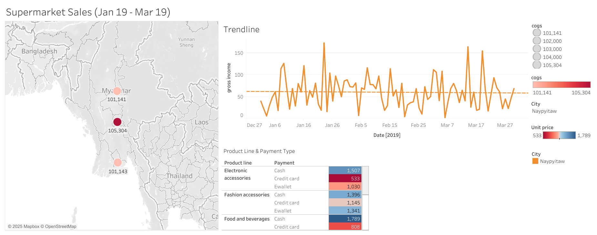

# 📊 Data Analytics Portfolio

Welcome to my data analytics portfolio! This page highlights the projects I completed using Power BI, Tableau, and other tools during my bootcamp and beyond.

## 🚀 Tableau Projects Dashboards

## 📊 Covid Cases Dashboard
This dashboard visualizes COVID-19 case trends, recoveries, and death rates over time, with interactive filters for region and time period.

**🔗 View Dashboard Online:** [Click here to view on Tableau Public](https://public.tableau.com/app/profile/athanasios.thanos/viz/CaseStudyDashboard3/Dashboard1?publish=yes)  
**⬇️ Download Tableau File (.twbx):** [Download here](dashboards/tableau/covid_case_study.twbx)  

## 📊 Profit of Sales Dashboard
This dashboard provides a visual overview of total profit trends and highlights the most profitable products. Key metrics include overall profit by month and top-performing products ranked by profit.

**🔗 View Dashboard Online:** [Click here to view on Tableau Public](https://public.tableau.com/app/profile/athanasios.thanos/viz/CaseStudy1Expand/Dashboard1?publish=yes&showOnboarding=true)  
**⬇️ Download Tableau File (.twbx):** [Download here](dashboards/tableau/case_study_1.twbx)  

## 📊 Superstore Analysis of Sales Dashboard
This dashboard analyzes Superstore sales using maps for regional performance, quantity vs. category (QTC) charts, trendlines, and interactive filters. It includes sales forecasts, average discount analysis, and tracks sales growth over the years.

**🔗 View Dashboard 1 Online:** [Click here to view on Tableau Public](https://public.tableau.com/app/profile/athanasios.thanos/viz/Book3_17431701257730/Dashboard1?publish=yes)  
**🔗 View Dashboard 2 Online:** [Click here to view on Tableau Public](https://public.tableau.com/app/profile/athanasios.thanos/viz/CaseStudyDashboard4/Dashboard1?publish=yes)  
**⬇️ Download Tableau File 1 (.twbx):** [Download here](dashboards/tableau/superstore_analysis_case_study_1.twbx)
**⬇️ Download Tableau File 2 (.twbx):** [Download here](dashboards/tableau/superstore_analysis_case_study_2.twbx) 

## 📊 Supermarket Sales Analysis Dashboard
This dashboard presents sales data from three supermarket departments in India, showing gross income trends over time, payment type distribution for each product category, and a map highlighting the three store locations with their respective COGS.

**🔗 View Dashboard Online:** [Click here to view on Tableau Public](https://public.tableau.com/app/profile/athanasios.thanos/viz/Book4-FirstCaseStudy/Dashboard1?publish=yes)  
**⬇️ Download Tableau File (.twbx):** [Download here](dashboards/tableau/supermarket_case_study.twbx)  

## 📊 Superstore Sales & Profit Insights Dashboard
This dashboard combines multiple visualizations including profit by category and sub-category, profit by shipping mode, sales by city (bubble chart), sales trends for the top 5 cities, sales by department, category, and shipping mode, and a combined discount vs. orders view. It brings all these charts together into an interactive layout with filters for detailed exploration.

**🔗 View Dashboard Online:** [Click here to view on Tableau Public](https://public.tableau.com/app/profile/athanasios.thanos/viz/FinalAssignment_17464583865740/Dashboard1?publish=yes)  
**⬇️ Download Tableau File (.twbx):** [Download here](dashboards/tableau/final_assignment.twbx)  

## 🚀 Power BI Projects Dashboards

---

## 📫 Contact
Feel free to connect with me on [LinkedIn](https://www.linkedin.com/in/thanasis-thanos-b041091b9/) or reach out by email.

